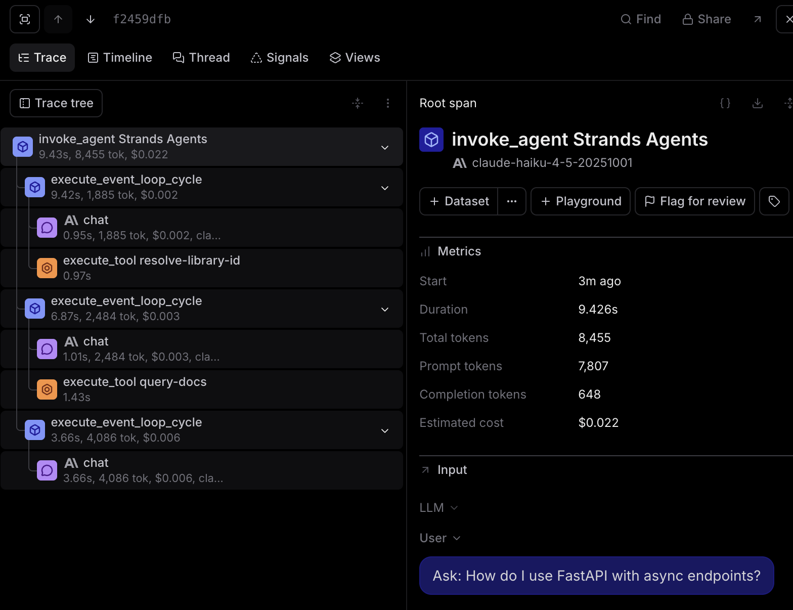
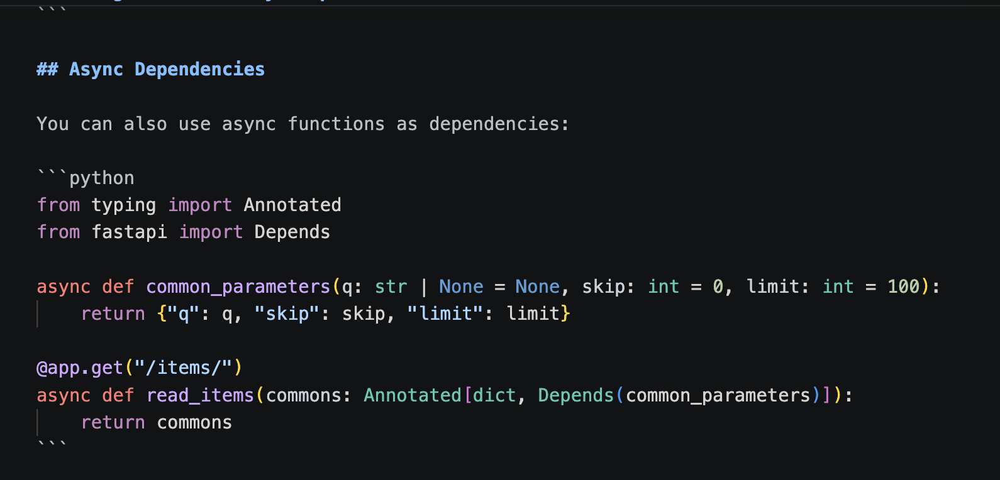
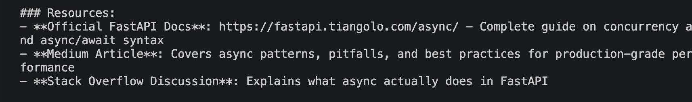

### MCP Observability

For this trace, I connected to the Context7 MCP server, which gives the agent access to real library documentation instead of just web search results. The query I used was "How do I use FastAPI with async endpoints?" — something specific enough that it would  trigger a docs lookup rather than a general search.

Looking at the trace, I can see the agent ran 3 event loop cycles. The first cycle called `resolve-library-id` to figure out which library I was asking about, the second called  `query-docs` to actually pull the documentation, and the third synthesized the final answer. 

What I noticed compared to the DuckDuckGo traces is that the MCP version pulls explicit, structured documentation — actual code examples and API references — whereas DuckDuckGo returns more general results with links to where you'd go find that documentation yourself. See below of my personal screenshots comparing the two. 

*MCP Output* 

*DuckDuckGo Output* 

The MCP trace also used noticeably more tokens (8,455 vs ~4,493) which makes sense since it's ingesting full doc pages rather than short search snippets.