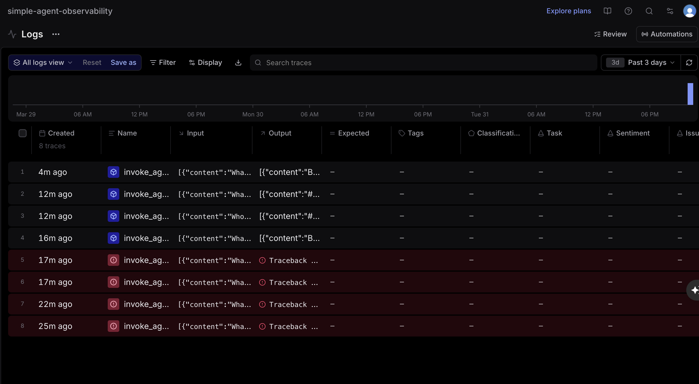
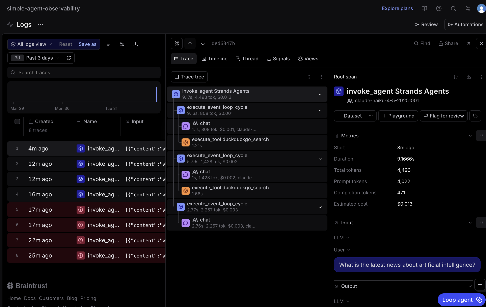
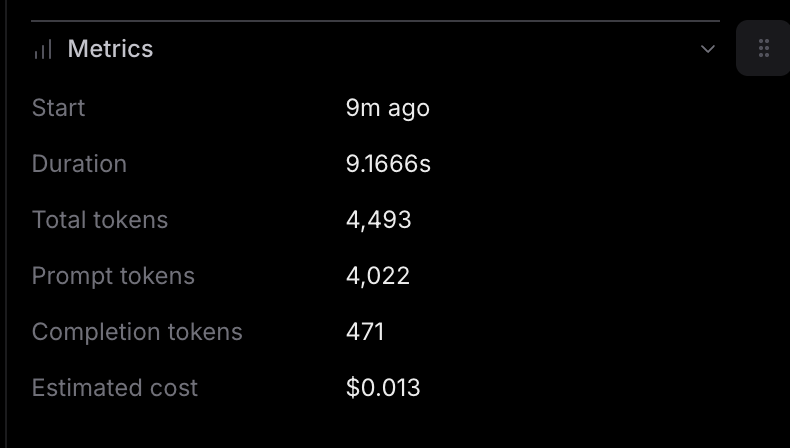

### Observability analysis

Looking at the Braintrust dashboard, I can see 8 total traces logged over the past 3 days. Traces 1–4 show blue icons (successful runs), while traces 5–8 are red — these failed with tracebacks. The failures correspond to earlier runs where the agent had a bug, which I was  able to fix before the later successful queries went through.

Clicking into trace 1, I can see exactly how the agent thinks through a question. It follows  a loop: call the LLM → run a DuckDuckGo search → call the LLM again → search again → then finally produce an answer. For my query "What is the latest news about artificial intelligence?", it went through 3 of these cycles before settling on a response. The whole thing took about 9.2 seconds, which I found interesting — most of that time was actually spent waiting on the search tool (~1–2s per call), not the LLM itself.

One thing that stood out to me in the metrics was the token breakdown: 4,022 prompt tokens vs. only 471 completion tokens for a single query. At first that ratio seemed off, but it makes sense once you understand the loop structure — every cycle re-sends the entire conversation history, so the prompt just keeps growing with each iteration. A question that requires more searches would eat up tokens even faster for this reason.

